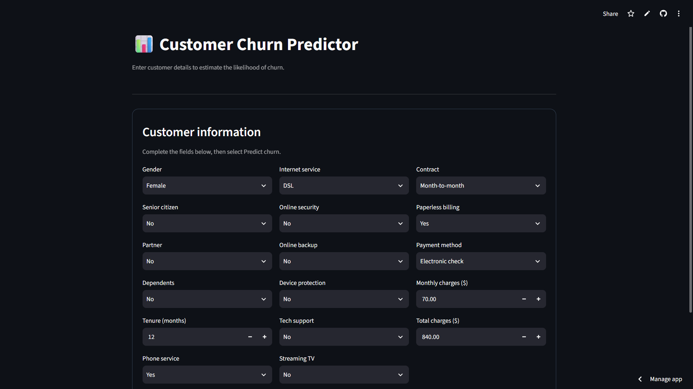
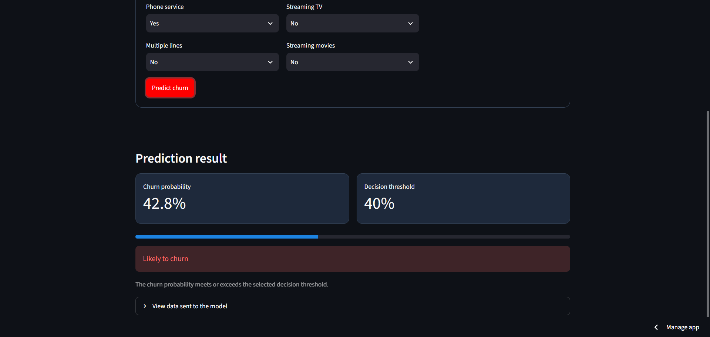

# Telco Customer Churn Predictor

A Streamlit web app that uses a trained scikit-learn Logistic Regression pipeline to estimate the likelihood of customer churn.

The app does **not** retrain the model. It loads the saved pipeline, sends it one raw customer row, gets a churn probability, and applies the project decision threshold of **0.40**.

## Live Demo

[Try the Customer Churn Predictor](https://customer-churn-predictor-5cewbvfxsmjufenjrvdwxl.streamlit.app/)

## App Preview




## 📊 Model Performance

The final Logistic Regression pipeline achieved:

- **Test ROC-AUC:** 0.856
- **Accuracy:** 0.79
- **Churn Precision:** 0.60
- **Churn Recall:** 0.66
- **Churn F1-score:** 0.62

The classification threshold was set to **0.40** instead of the default 0.50 to improve the model's ability to identify potential churners.

## 🎯 Decision Threshold

The default classification threshold is 0.50, but this project uses **0.40**.

A lower threshold makes the model more willing to classify a customer as likely to churn. This increases recall for the churn class, helping identify more potential churners at the cost of some precision.

The threshold was selected by comparing precision, recall, and F1-score across multiple thresholds.

## 🛠️ Tech Stack

- Python
- Pandas
- Scikit-learn
- Joblib
- Streamlit
- Logistic Regression

## Project layout

```text
.
├── app.py
├── requirements.txt
├── README.md
├── models/
│   ├── churn_model.pkl       # required: saved best_model pipeline
│   └── threshold.pkl         # optional: saved threshold (0.40 is the fallback)
└── notebooks/                # keep your training / EDA notebooks here
```

## First-time setup

1. Create the `models` folder.
2. Copy the artifacts saved from the training notebook into it:

   ```python
   joblib.dump(best_model, "models/churn_model.pkl")
   joblib.dump(0.4, "models/threshold.pkl")
   ```

   `best_model` must be the whole pipeline: preprocessing plus Logistic Regression. Do not save only the classifier.

3. Install the packages:

   ```bash
   pip install -r requirements.txt
   ```

4. Start the app:

   ```bash
   streamlit run app.py
   ```

## How a prediction works

```text
Form inputs → one-row pandas DataFrame → saved preprocessing pipeline
            → Logistic Regression probability → threshold (0.40) → result
```

The app collects the standard raw Telco fields and then uses the column names stored by the loaded pipeline. This protects the app from mismatched feature order and lets it work with a saved model variant that expects fewer fields.

## Concepts to understand

- **Inference:** using a trained model on a new customer. There is no `.fit()` in the app.
- **Pipeline:** the saved object contains the original preprocessing (scaling and one-hot encoding) and the classifier, so the app supplies raw values such as `"Fiber optic"`.
- **DataFrame:** the `[value]` wrapping used in a notebook becomes one DataFrame row here; models expect a table-shaped input even for one customer.
- **Probability vs. decision:** the model returns a number from 0 to 1. The project rule converts it to churn/not-churn using `probability >= 0.40`.

## Note on input fields

The common IBM Telco dataset has 19 usable raw input columns after removing `customerID` and `Churn`. If your final pipeline was trained with a reduced set (for example, 17 columns), the app automatically sends only the exact columns stored in that pipeline.

## 📌 Dataset

This project uses the IBM Telco Customer Churn dataset.

The dataset contains customer demographic information, account information,
services used, and billing information. The target variable is `Churn`,
which indicates whether the customer left the company.